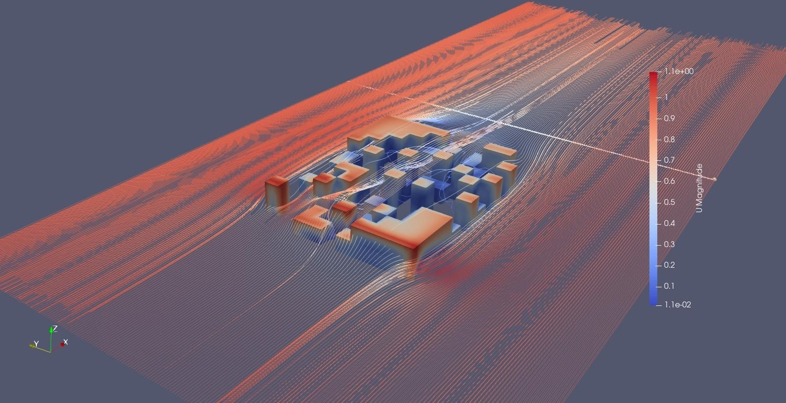

# Full Domain Analysis for Fluid Mechanics (FullDA-FM)

The cooling effects of cities due to corridor winds from the surrounding countryside are important for our cities, especially in the light of climate catastrophe. If we want to adapt our cities, we must consider such effects in urban planning and architecture. It is imperative that it is clear early in the design process which designs will support these effects and which ones will cause issues.

In the project “Full Domain Analysis for Fluid Dynamics” we are working on algorithms that generate a variety of possible designs to support architects, municipalities and other stakeholders (see figure 2). Design decisions should show as early as possible how the airflow
could behave with a wide variety of design solutions. In the project, we use efficient divergent optimization methods to find the broadest possible
overview of design solutions. Computer simulations of flows (Computational Fluid Dynamics - CFD) play a crucial role here. For the analysis of the results we also deal with state-of-the-art visualization methods.

Quick overview:
* We generate many different geometries for building designs using evolutionary Quality Diversity algorithms
* The geometries are optimized to reduce wind blockage
* Optimization is performed making use of computational fluid dynamics
* Since it is infeasible to simulate all steps in the design process, we use efficient statistical models to reduce the number of necessary CFD simulations
* Through state-of-the-art visualization methods we allow comparison of the flows around these different building designs.

# Terms
Phenotype: Central object of communication between optimization, cfd and visualization. A grid-like structure that contains building heights per grid cell. Resolution of approximately 100x100 cells in the grid.

# Current Status

## Optimization

## CFD

## Visualization
